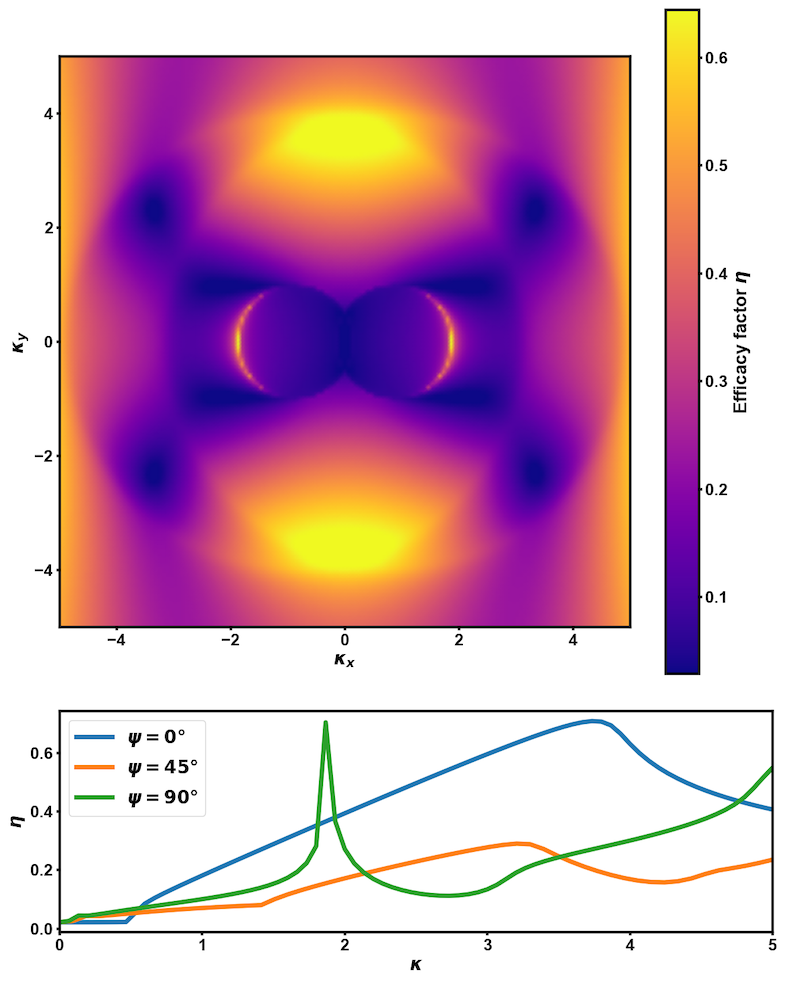
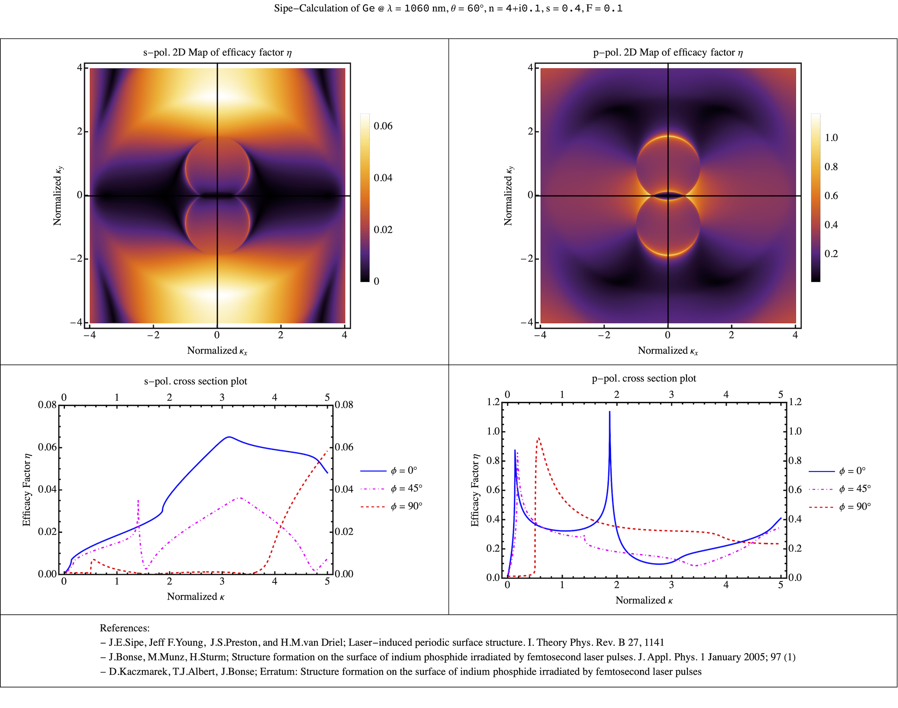

[](https://doi.org/10.1063/5.0222903)

# LIPSS_SIPE

This package implements the calculation of the so-called 'efficacy factor' ($\eta$) [[3]](#3) based on Ref. [[1]](#1), and is published along with [[2]](#2).

If you find this software useful, please cite [[2]](#2).

## Usage

`LIPSS_SIPE` comes with a CLI and an example Jupyter Notebook as well as a Mathematica Notebook.

### Command Line Interface

The command line script can be run via

```
python -m lipss_sipe
```

It calculates the efficacy factor for given values for the filling factor $F$, the shape factor $S$, the complex dielectric function of a material at a given wavelength $\varepsilon$, the angle of incidence of the laser in degrees $\theta$, and the laser polarization in a given range of the normalized LIPSS wave vector components $\kappa_x$ and $\kappa_y$. These dimensionless LIPSS wave vectors are defined as $\kappa=k\cdot\lambda / 2\pi = \lambda/\Lambda$.
These parameters are requested when the program is started.
They can also be given via command line arguments:

```
-h, --help                              show this help message and exit
--f F                                   Filling factor
--s S                                   Shape factor
--n n k                                 Refractive index n and absorption coefficient k at the irradiation wavelength
--angle ANGLE                           Angle of incidence of the laser in degrees
--polarization POLARIZATION {s,p}       Polarization of the laser
--x_range start stop num                Range and number of normalized values for the x-component of the wavevector
--y_range start stop num                Range and number of normalized values for the y-component of the wavevector
```

### Example Jupyter notebook

The Jupyter Notebook `example.ipynb` shows how to use the package. The given parameters are taken from Fig. 14 of [[4]](#4) and produce the following plot:



### Mathematica Notebook

The Mathematica Notebook `lipss_sipe.nb` calculates $\eta$ for s- and p-polarization and takes the material name $M$, the laser wavelength $\Lambda$, the angle of incidence of the laser in degrees $\theta$, the refractive index $n$, the optical extinction coefficient $k$, the shape factor $s$, the filling factor $F$. One can also choose the orientation of the pattern between horizontal and vertical. In the plotting section of the notebook one can choose the angle $\phi$ for the third cross section between $0°$ and $90°$ and give the maximum of the y-axis.
It is important to first evaluate the cell before entering or selecting the parameters.

For Germanium at $\lambda=1060$ nm under $\theta=60°$ with $s=0.4$ and $F=0.1$ one gets the folliwing plot:



## Installation

lipss-sipe can be installed from [Github](https://github.com/tjalb/lipss_sipe):

```
python -m pip install git+https://github.com/tjalb/lipss_sipe.git
```

## Dependencies

Python 3.10 is tested. The following modules need to be installed:

- [`numpy`](https://numpy.org)
- [`matplotlib`](https://matplotlib.org)
- [`tqdm`](https://github.com/tqdm/tqdm)

## Acknowledgements

This work was funded by the Deutsche Forschungsgemeinschaft (DFG, German Research Foundation) Project No. 278162697-SFB 1242.

## References

<a id="1">[1]</a> Bonse, J., Munz, M., Sturm, H. (2005). Structure formation on the surface of indium phosphide irradiated by femtosecond laser pulses. Journal of Applied Physics, 97(1), 013538. [DOI: 10.1063/1.1827919](https://doi.org/10.1063/1.1827919)

<a id="2">[2]</a> Kaczmarek, D., Albert, T. J., Bonse, Munz, M., Sturm, H., J., Erratum: "Structure formation on the surface of indium phosphide irradiated by femtosecond laser pulses". [DOI:10.1063/5.0222903](https://doi.org/10.1063/5.0222903)

<a id="3">[3]</a> Sipe, J. E., Young, J. F., Preston, J. S., & van Driel, H. M. (1983). Laser-induced periodic surface structure. I. Theory. Physical Review B, 27(2), 1141–1154. [DOI: 10.1103/PhysRevB.27.1141](https://doi.org/10.1103/PhysRevB.27.1141)

<a id="4">[4]</a> Young, J. F., Preston, J. S., van Driel, H. M., & Sipe, J. E. (1983). Laser-induced periodic surface structure. II. Experiments on Ge, Si, Al, and brass. Physical Review B, 27(2), 1155–1172.  [DOI: 10.1103/PhysRevB.27.1155](https://doi.org/10.1103/PhysRevB.27.1155)
